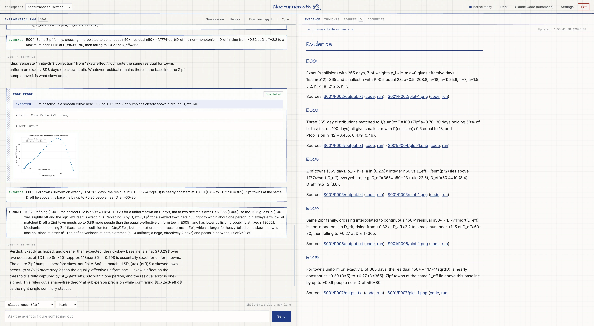

# Nocturnomath

Nocturnomath is a lightweight, hypothesis-driven scientific probing tool. It combines a persistent Jupyter kernel, citable Markdown evidence and thoughts, and two interfaces on one shared runtime: a split-screen local web app and a terminal client.



> [!WARNING]
> Nocturnomath is an experimental research preview. It executes model-generated Python and can read and modify files in the workspace you select. Run the web interface only on a trusted machine using its default loopback address; it has no authentication and must not be exposed to a network. Expect breaking changes and verify important scientific results independently.

## Features

- **Web dashboard:** Chat with Claude beside a live Markdown reader and a figures gallery that can be filtered by session. Probe cards show predictions, code, output, plots, and kernel status.
- **Terminal client:** Stream Markdown replies, run the same probes and commands, and view compact kernel, model, context, and session status.
- **Persistent research record:** Save session transcripts, probe artifacts, numbered evidence, interpretations, and notebook exports inside each workspace.
- **Flexible environments:** Use an automatically managed Python environment or select an existing interpreter.
- **Explicit authentication:** Use Claude Code's existing login, a subscription token, or an API key. Credentials entered in the app stay in process memory.

## Quick start

Nocturnomath requires Python 3.12 or later, [uv](https://docs.astral.sh/uv/), and access to Claude through Claude Code or an API key.

Install the current version directly from GitHub:

```bash
uv tool install git+https://github.com/fmottes/nocturnomath.git
nocturnomath
```

Update an installation made this way to the latest version:

```bash
uv tool upgrade nocturnomath
```

For a local checkout:

```bash
git clone https://github.com/fmottes/nocturnomath.git
cd nocturnomath
uv sync
uv run nocturnomath
```

By default, Nocturnomath uses the current directory: the web app confines its workspace picker to that directory tree, and the terminal client opens it directly. Change to the directory you want before launching:

```bash
cd /path/to/project
nocturnomath
```

Alternatively, set that location without changing directories by passing `--path` / `-p`:

```bash
nocturnomath --path /path/to/project
```

Both interfaces accept:

- `--path`, `-p`: starting folder; the terminal opens it immediately
- `--python`: research Python executable, or `managed`
- `--default-model`: exact Claude model identifier for new sessions; when omitted, uses the model reported as the SDK default
- `--default-effort`: reasoning effort for new sessions (`low`, `medium`, `high`, `xhigh`, or `max`); when omitted, Nocturnomath uses `high`
- `--timeout`: kernel-run limit in seconds (default: `600`)
- `--images`: plots returned to Claude per run (default: `2`)

The web app also accepts `--port` (default `8000`), a loopback-only `--host` (default `127.0.0.1`), and `--no-browser`.

### Remote use over SSH

Start the web app on the private remote machine without opening a browser there:

```bash
nocturnomath --host 127.0.0.1 --port 8000 --no-browser --path /path/to/workspace-root
```

Forward the loopback port from your local machine, then open `http://127.0.0.1:8000` locally:

```bash
ssh -N -o ExitOnForwardFailure=yes \
  -L 127.0.0.1:8000:127.0.0.1:8000 user@remote-host
```

The web launcher refuses non-loopback bind addresses.

The web Settings panel can override the model and effort used for each new session in the current workspace. The message composer still controls only the next message.

### Claude authentication

By default, Nocturnomath uses Claude Code's current authentication. If `claude` works in your terminal, no additional login is needed. Environment settings such as `ANTHROPIC_API_KEY`, cloud-provider configuration, `ANTHROPIC_BASE_URL`, and `apiKeyHelper` continue to follow Claude Code's precedence rules.

Use the web app's **Claude** button or the terminal's `/auth` command to choose:

- **Claude subscription:** Run `claude setup-token`, then enter the resulting token.
- **Claude API key:** Enter a key from the [Claude Console](https://platform.claude.com/settings/keys). API usage is billed separately from a subscription.
- **Claude Code (automatic):** Return to Claude Code's default authentication.

Manually entered credentials override credential environment variables only for the launched Claude client. They are not written to browser storage, shell history, transcripts, or workspace files, and must be re-entered after restarting. Selecting a method does not validate it or make a billable request; errors appear when you send the next message. Authentication changes do not restart the kernel or conversation.

### Terminal mode

Run Nocturnomath without a browser after installing it as a tool:

```bash
nocturnomath-cli --path /path/to/project
```

From a local checkout, use:

```bash
uv run nocturnomath-cli --path /path/to/project
```

Enter sends; Esc then Enter (or Alt+Enter) inserts a newline. Ctrl-C interrupts the active query or kernel run without quitting. Ctrl-D and `/exit` drain active work, release the kernel, and exit. Input history is stored in `.nocturnomath/terminal_history`, and typing `/` opens command completion.

| Command | Description |
| --- | --- |
| `/help` | List commands |
| `/new` | Start a chat on a fresh kernel |
| `/restart` | Restart the kernel and clear memory |
| `/notes` | Show evidence and thoughts |
| `/history` | List workspace chats |
| `/resume <S001> [--kernel]` | Reopen a chat; optionally replay its probes |
| `/export [path]` | Export the chat as a Jupyter notebook |
| `/model [name]` | Show or select a model for the next message |
| `/auth [status\|subscription\|api-key\|claude-code]` | Show or change authentication |
| `/context [on\|off]` | Show or change context carry-over |
| `/env <python>\|managed` | Switch research environment |
| `/workspace <path>` | Open another workspace |
| `/docs [name]` | List the documents folder or render one |
| `/plots` | List saved plots |
| `/exit` | Stop and exit |

`/export` uses the current directory by default. A directory keeps the generated `nocturnomath-<workspace>-<session>.ipynb` name; a file path overrides it. State-changing commands are refused while a query is running.

## Workspace and scientific record

Nocturnomath stores its managed artifacts in the selected workspace:

```text
.nocturnomath/
├── kb/
│   ├── evidence.md
│   └── thoughts.md
├── documents/
│   └── inputs.md
├── sessions/
│   └── S001/
│       ├── transcript.jsonl
│       └── probes/P001/
│           ├── code.py
│           ├── probe.json
│           ├── output.txt
│           └── plot-1.png
├── runtime/
├── venv/
└── scratch/
```

The hidden `.nocturnomath/` folder can contain prompts, transcripts, generated code,
outputs, plots, and other sensitive research context. If the selected workspace is
version-controlled, add `.nocturnomath/` to that workspace's `.gitignore` before use;
Nocturnomath does not modify the surrounding repository's ignore rules.

`evidence.md` contains numbered observations (`E001`, `E002`, …), each limited to 250 characters plus generated source links. Observations state what happened and under which conditions. `thoughts.md` contains numbered interpretations (`T001`, `T002`, …), usually one 80–150-word paragraph, with citations such as `[E001]` and `[T001]`.

Evidence links to its probe output or plots, code, and run metadata. The web reader follows citations and opens those artifacts; `/notes`, `/docs`, and `/plots` expose them in the terminal.

`documents/` holds free-form Markdown files that give the agent extra context: your inputs, generated reports, calculations. The Documents tab lists them with a checkbox that decides whether each one is sent with the next message, renders a document on click, and lets you create, modify, or delete one in place. Settings chooses whether new documents start checked. With context kept, a document is sent only when it is new or has changed.

Entries keep stable wording and IDs. Invalid evidence is struck in full, and its correction becomes a new observation. Corrected thoughts are also appended and linked to the superseded entries. Struck entries remain part of the citable history but are not valid support for conclusions.

Evidence and thoughts span sessions. A new session starts an empty chat and fresh kernel. Resuming a session appends to its existing record but normally starts with empty Python memory. Choose resume-with-kernel in the web app, or `/resume S001 --kernel`, to replay stored probes. Refreshing the browser reconnects to the same session and restores its chat.

Probe IDs are session-local. Code and predictions are saved before execution; text output and plots are saved afterward, including partial output from interruptions. `probe.json` records the model, timestamps, prediction, kernel, and outcome. These are execution artifacts, not input snapshots or a fully reproducible kernel state.

Both interfaces provide model selection for the next message and context carry-over, which is enabled by default. In the web app, use the model selector and Settings → Experimental; in the terminal, use `/model` and `/context`.

## Research environments

Opening a workspace prepares `.nocturnomath/venv`, separate from any project `.venv`, with ipykernel, matplotlib, NumPy, and pandas. Packages persist across sessions; kernel variables do not. The first setup may download packages, while later openings reuse the environment.

Kernels start in the workspace with their home, temporary, cache, configuration, and history locations redirected under `.nocturnomath/runtime/`. Nocturnomath also removes its Claude credentials and SSH-agent access from the kernel environment. This keeps routine library and shell activity local to the workspace, but it is not an operating-system sandbox: code using an explicit absolute path can still access files allowed to your user account.

Select another Python executable in Settings → Research environment, with `/env /path/to/venv/bin/python`, or through `--python`. A custom environment must already contain ipykernel and matplotlib and is not modified during selection. The choice is saved in `.nocturnomath/config.json`; choose **Use managed environment**, `/env managed`, or `--python managed` to return to the default. Switching environments starts a new session.

Package installations made through the agent target the selected interpreter and do not restart the kernel. Nocturnomath records the command, output, environment inventories, and kernel identifiers with the session. Already imported modules retain their loaded versions until the kernel restarts.
